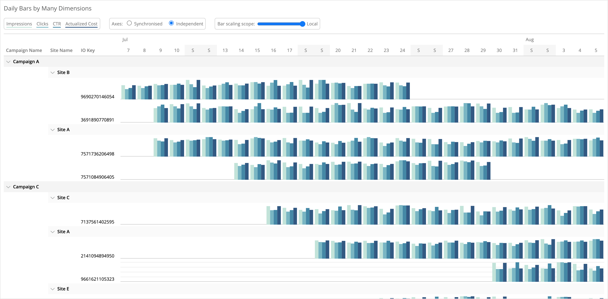

# Bar Pivot
Custom widget for Marketing Cloud Intelligence. Visualises up to four metrics, over many dimensions, pivoted by a date.

This custom widget creates separate partitions for each dimension you add, and visualises up to four measurements in each date. Mouseover a date for exact figures, explore your data with the controls at the top, and collapse hierarchies you don't need to see.

## Set up and Dependencies
Add `barPivot.initialize();` to the JS section of the Custom Widget Editor, and add the below links to the dependencies area (second button at the top left of the Custom Widget Editor).

Style: `https://solutions.datorama-res.com/public_storage_solutions/barPivot/v1/barPivot.css`
Script: `https://solutions.datorama-res.com/public_storage_solutions/barPivot/v1/barPivot.js`

## Preferences
All preferences are located in the design tab of the widget options. These include default bar scaling choices, visualisation colours, and the date by which to pivot.