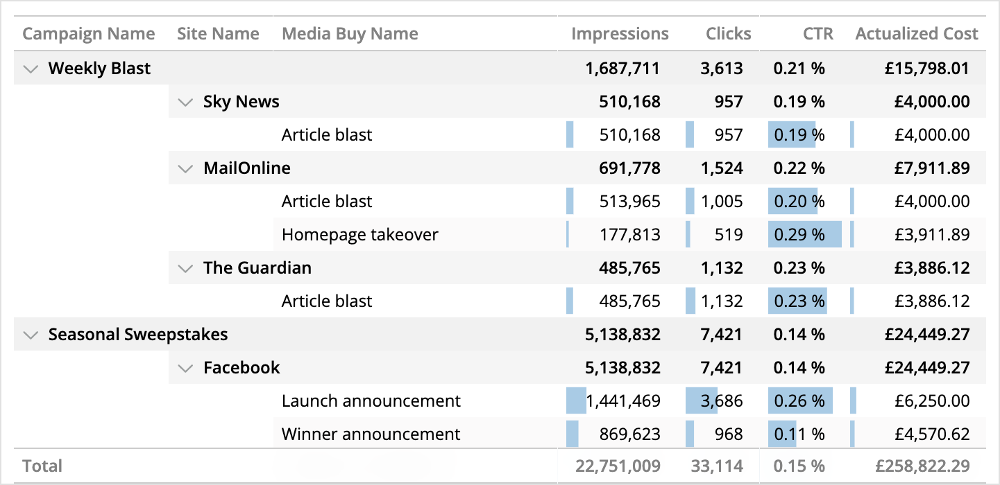

# Data Bars Table
Custom widget for Marketing Cloud Intelligence. Creates an Excel-like Data Bars Table.

This works just like a pivot table, except bars are added inside each cell to show a visual representation of the data, scaled within the column's data range. This combines the exactness of tables with the clarity of bar charts to let you easily identify rows and columns of most interest.

Subtotals are calculated and formatted if the metric is detected to be summable, or calculable by division of other summable fields present in the query (such as in the preview below).

## Set up and Dependencies
Add `dataBarsTable.initialize();` to the JS section of the Custom Widget Editor, and add the below links to the dependencies area (second button at the top left of the Custom Widget Editor).

Style: `https://solutions.datorama-res.com/public_storage_solutions/dataBarsTable/v1/dataBarsTable.css`
Script: `https://solutions.datorama-res.com/public_storage_solutions/dataBarsTable/v1/dataBarsTable.js`

## Preferences
All preferences are located in the widget's Design tab. These include whether to create data bars for each metric, and the colour of the data bar for each metric.