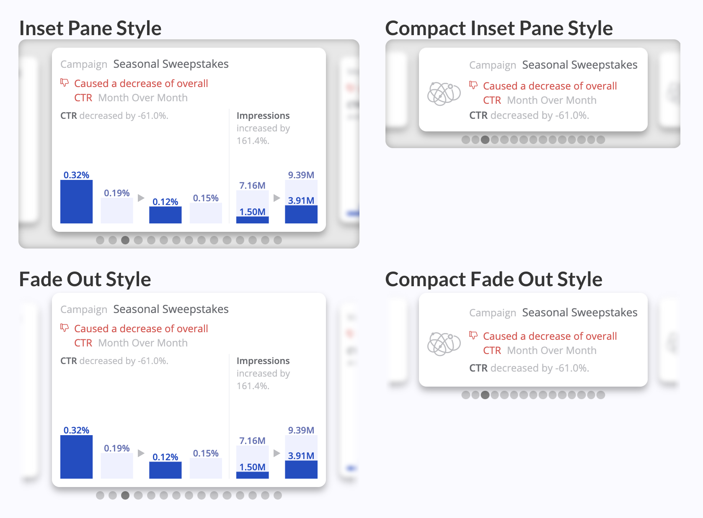

# Einstein Marketing Insights Carousel
Custom widget for Marketing Cloud Intelligence. Visualises insights from Einstein Marketing Insights bots in the workspace.

This custom widget loads insights from a single bot in the workspace and presents it in a simple carousel format. No code required: all configuration options are located in the widget's design panel.

## Style and Script Dependencies
Add `emiCarousel.initialize();` to the JS section of the Custom Widget Editor, and add the below links to the dependencies area (second button at the top left of the Custom Widget Editor).

Style: `https://solutions.datorama-res.com/public_storage_solutions/emiCarousel/v1/emiCarousel.css`
Script: `https://solutions.datorama-res.com/public_storage_solutions/emiCarousel/v1/emiCarousel.js`

## Recommended Configuration
### Size
As a small, interactive, non-intrusive widget, it's designed to be small. However, it's not designed to be displayed below a minimum size. On MC Intelligence dashboard pages we don't have the luxury of creating fixed-width elements, so you *must* size this widget for the smallest screen it will be viewed on.

Under default widget padding and page margin settings and on a 1440px wide laptop screen, this is
* **10 units wide** (1/3 of a dashboard page width), and
* **6 units tall without a title**, and 7 units tall with a title.
If your viewer's screen may be smaller than that, resize the widget accordingly. This will generate the 'compact' text-only style shown above.

To display the larger size with visualisations, on a 1440px wide laptop screen, this is
* **11 units wide**, and
* **10 units tall without a title**, and 11 units tall with a title.

### Performance
To eliminate usage of the value format API, greatly improve performance, and make number displays more concise, set your locale and choose pre-defined measurement formats from the widget design panel for all measurements.