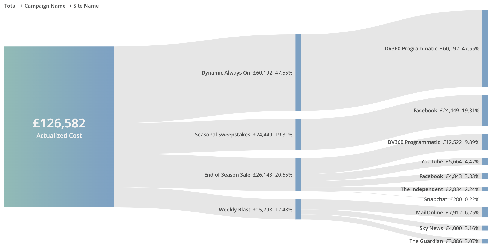

# River Breakdown
Custom widget for Marketing Cloud Intelligence. Visualises hierarchical breakdowns.

This custom widget creates river-like breakdowns for each dimension you add, and gives you context-specific mouseover percentage calculation. It doesn't re-combine like a sankey flow diagram, as the intention is to show hierarchies.

The metric visualised in this widget must be summable, i.e. each row adds up to the total. Calculated metrics are also supported, as long as their constituent parts are also summable and present in the query.

## Set up and Dependencies
Add `riverBreakdown.initialize();` to the JS section of the Custom Widget Editor, and add the below links to the dependencies area (second button at the top left of the Custom Widget Editor).

Style: `https://solutions.datorama-res.com/public_storage_solutions/riverBreakdown/v1/riverBreakdown.css`

Script: `https://solutions.datorama-res.com/public_storage_solutions/riverBreakdown/v1/riverBreakdown.js`

## Preferences
All preferences are located in the widget's Design panel. These are colours for the gradient and subsequent blocks.