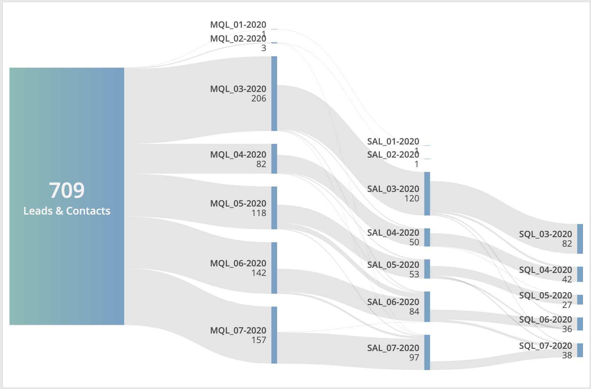

# Sankey Flow Diagram
Custom widget for Marketing Cloud Intelligence. Creates a Sankey Flow Diagram.

This custom widget transforms supplied data and creates a Sankey Flow Diagram. The input is multiple dimensions linked together by one measurement.

The metric visualised in this widget must be summable, i.e. each row adds up to the total. Calculated metrics are also supported, as long as their constituent parts are also summable and present in the query.

## Set up and Dependencies
Add `sankey.initialize();` to the JS section of the Custom Widget Editor, and add the below links to the dependencies area (second button at the top left of the Custom Widget Editor).

Style: `https://solutions.datorama-res.com/public_storage_solutions/sankey/v1/sankey.css`
Script: `https://solutions.datorama-res.com/public_storage_solutions/sankey/v1/sankey.js`

## Preferences
All preferences are located in the widget's design panel. These include
* gradient and node colours;
* label layout; and
* node and link removal.